# ESP32C6 Blinky No Standard

_A fun project that me and my sons have undertaken ;>_

The example blinks an LED and makes the onboard RGB LED glow with an `ESP32C6` micro controller.

It provides instructions on how to configure WSL2 with the provided devcontainer. `Wokwi` diagram of the project is included, so that a virtual setup can be used to test the code before running it in real life. This environment makes it easy to work with the microcontroller.

## Physical

In action physically:

* LED Off / RGB LED Blue

  

* LED On / RGB LED Blue

  

* LED Off / RGB LED Red
  
  

* LED On / RGB LED Green

  

## Virtual

In action virtually:

* LED Off / RGB LED Green

  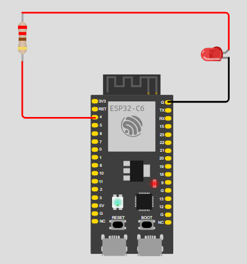

* LED On / RGB LED Purple

  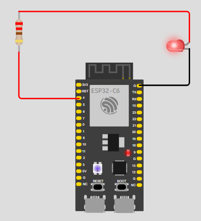

* LED Off / RGB LED Yellow

  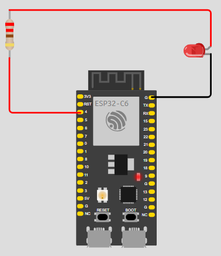

* LED On / RGB LED Red

  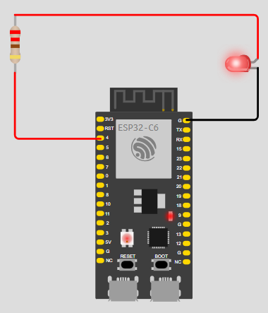

## Hardware - Diymore ESP32-C6-WROOM-1 Module with dual TYPE-C Interface

_The current microcontroller that the code is running on for the photos._

[Diymore ESP32-C6-WROOM-1 Module with dual TYPE-C Interface](https://www.diymore.cc/collections/esp32)

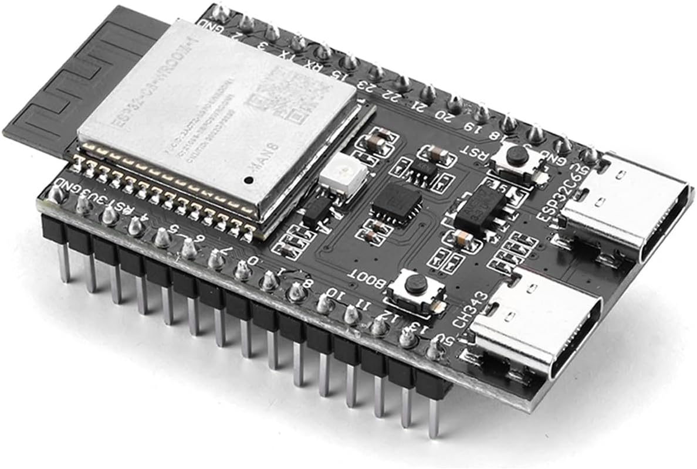

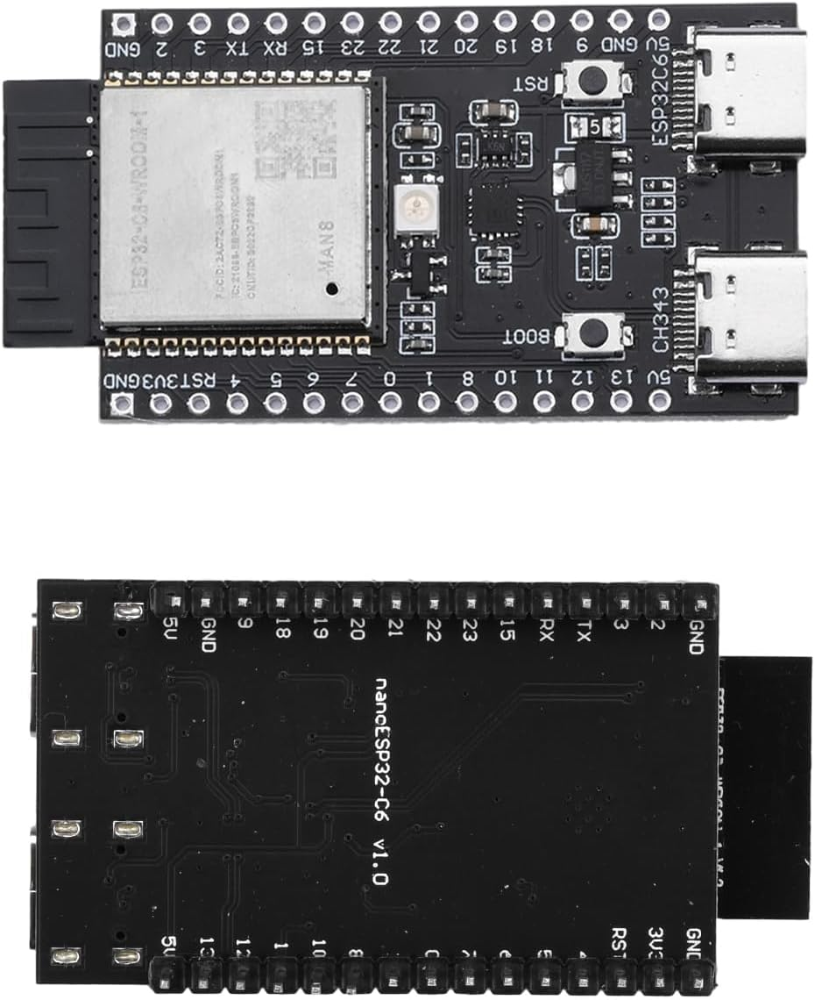

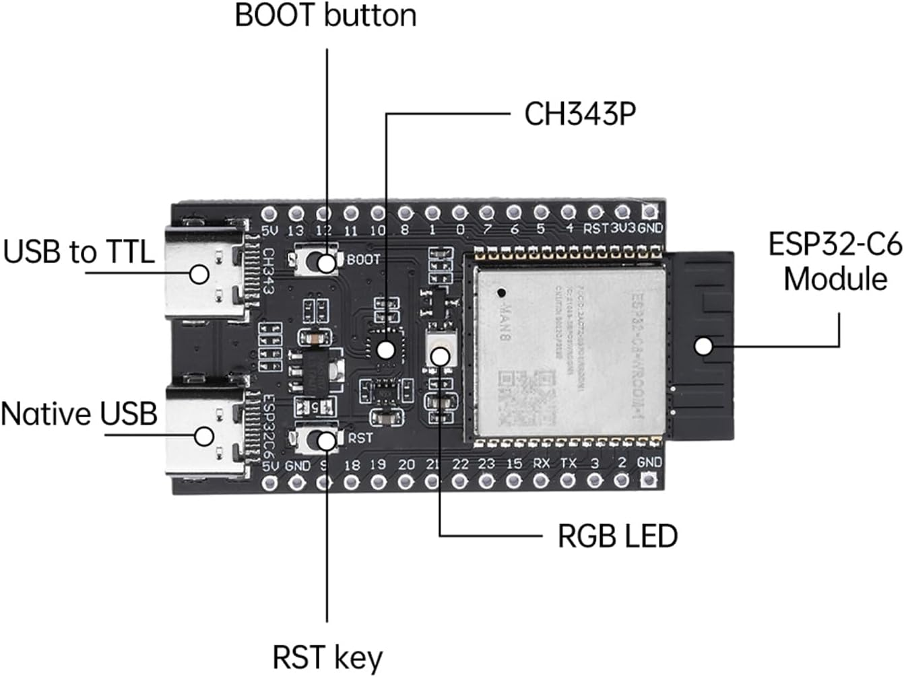

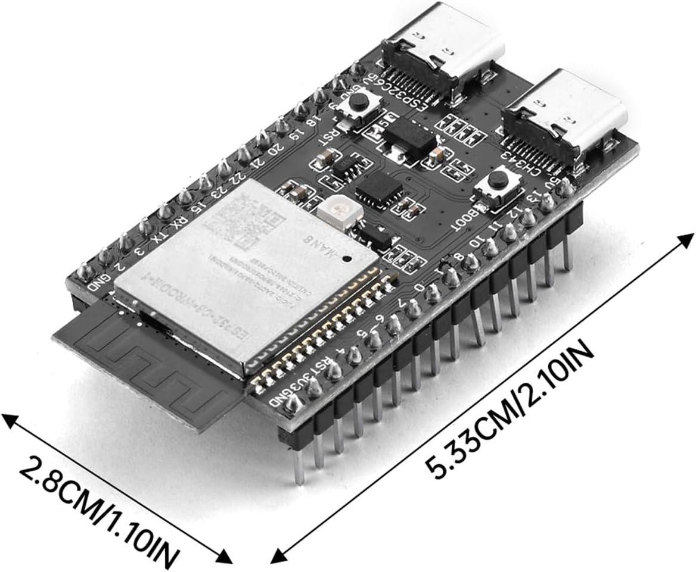

## Hardware - Waveshare ESP32-C6-DEV-KIT-N8

[Waveshare ESP32-C6-DEV-KIT-N8](https://www.waveshare.com/wiki/ESP32-C6-DEV-KIT-N8)

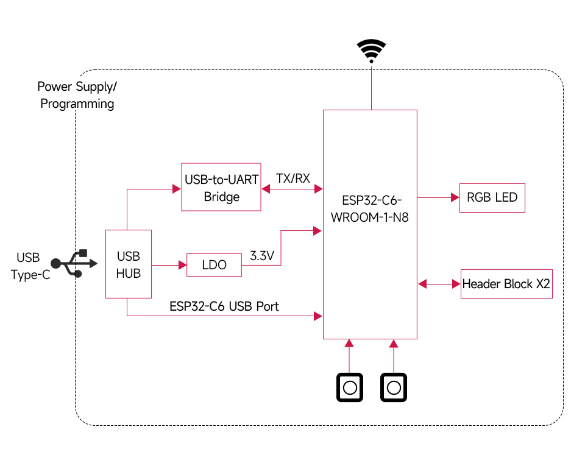

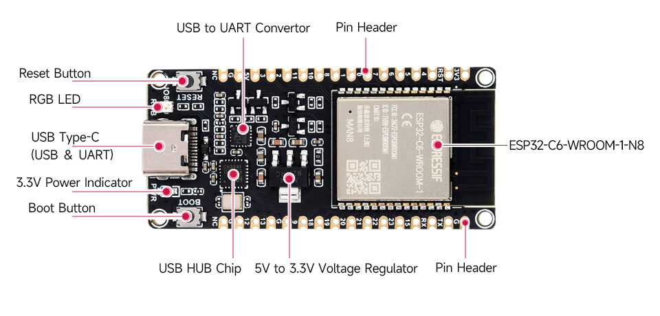

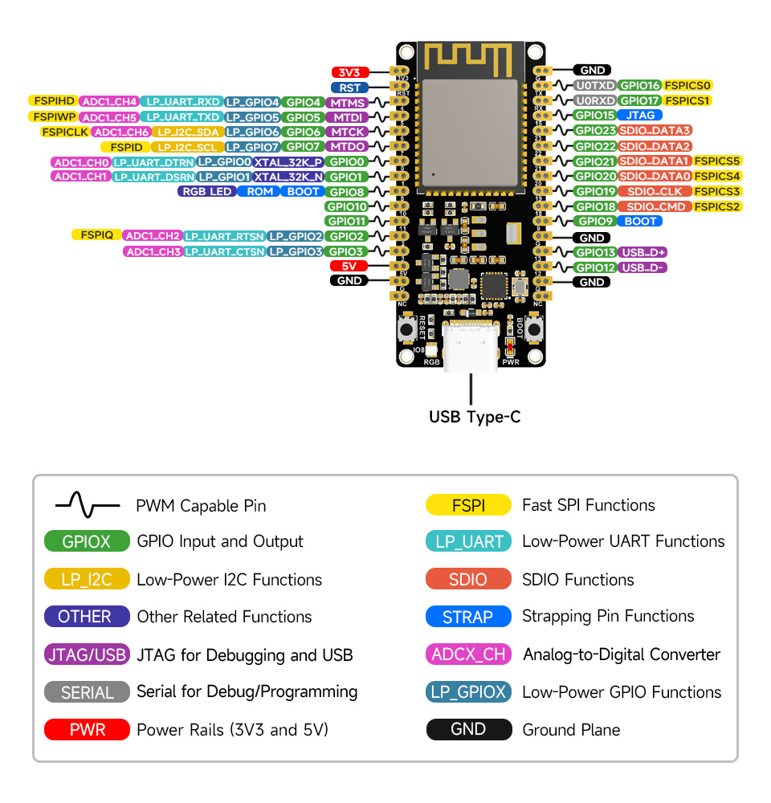

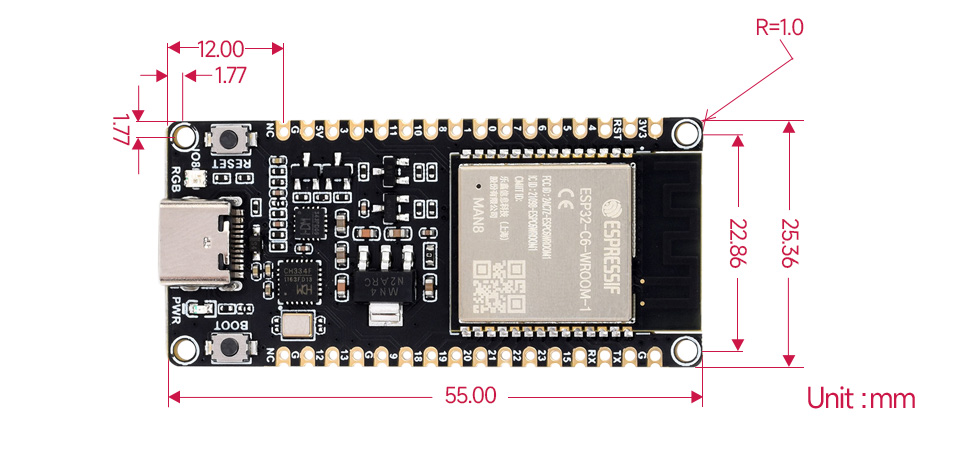

## Configuring WSL2 for development
### Use WSL kernel that support usb ip
To download custom kernel https://github.com/taliesins/WSL2-Linux-Kernel-Rolling/releases

Create or edit the file `%USERPROFILE%\.wslconfig` with the following content:

```
[wsl2]
kernel=C:\\bzImage
```

Open a PowerShell terminal window as Administrator

Stop the WSL instance:
PowerShell
```
wsl --shutdown
```

### Setup permission on WSL
```
wsl
sudo su

sudo getent group dialout
sudo usermod -a -G dialout $USER
sudo getent group dialout

exit
wsl --shutdown
```
### Install usbip-win onto Windows host
To download windows cli: https://github.com/dorssel/usbipd-win/releases

### Attach serial and jtag ports of microcontroller to WSL

Instruction to get COM port forwarded to WSL https://github.com/dorssel/usbipd-win/wiki/WSL-support

See the devices that are available:
```
usbipd list
```

```
C:\WINDOWS\system32>usbipd list
Connected:
BUSID  VID:PID    DEVICE                                                        STATE
2-5    8087:0032  Intel(R) Wireless Bluetooth(R)                                Not shared
2-7    13d3:56d5  Integrated Camera, Integrated IR Camera                       Not shared
2-8    1532:0245  USB Input Device, Razer Blade                                 Not shared
4-2    1a86:55d3  USB-Enhanced-SERIAL CH343 (COM3)                              Not shared
4-4    303a:1001  USB Serial Device (COM4), USB JTAG/serial debug unit          Not shared

Persisted:
GUID                                  DEVICE
```

To attach to serial port of microcontroller:
```
usbipd bind --busid 4-2 --force 
usbipd attach --wsl --busid=4-2 
```

```
C:\WINDOWS\system32>usbipd bind --busid 4-2

C:\WINDOWS\system32>usbipd attach --wsl --busid=4-2
usbipd: info: Using WSL distribution 'Ubuntu-22.04' to attach; the device will be available in all WSL 2 distributions.
usbipd: info: Using IP address 10.152.0.1 to reach the host.
```

To attach to jtag port of microcontroller:
```
usbipd bind --busid 4-4 --force
usbipd attach --wsl --busid=4-4
```

```
C:\WINDOWS\system32>usbipd bind --busid 4-4

C:\WINDOWS\system32>usbipd attach --wsl --busid=4-4
usbipd: info: Using WSL distribution 'Ubuntu-22.04' to attach; the device will be available in all WSL 2 distributions.
usbipd: info: Using IP address 10.152.0.1 to reach the host.
```

See if the ports are attached to wsl:
```
usbipd list
```

```
C:\WINDOWS\system32>usbipd list
Connected:
BUSID  VID:PID    DEVICE                                                        STATE
2-5    8087:0032  Intel(R) Wireless Bluetooth(R)                                Not shared
2-7    13d3:56d5  Integrated Camera, Integrated IR Camera                       Not shared
2-8    1532:0245  USB Input Device, Razer Blade                                 Not shared
4-2    1a86:55d3  USB-Enhanced-SERIAL CH343 (COM3)                              Attached
4-4    303a:1001  USB Serial Device (COM4), USB JTAG/serial debug unit          Attached

Persisted:
GUID                                  DEVICE

```

See ports inside WSL:
```
lsusb
```

```
taliesins@tali-laptop:~$ lsusb
Bus 002 Device 001: ID 1d6b:0003 Linux Foundation 3.0 root hub
Bus 001 Device 003: ID 303a:1001 Espressif USB JTAG/serial debug unit
Bus 001 Device 002: ID 1a86:55d3 QinHeng Electronics USB Single Serial
Bus 001 Device 001: ID 1d6b:0002 Linux Foundation 2.0 root hub
```

### Attach serial and jtag ports of microcontroller to WSL after disconnection

If you hit reset or pull the cable out, you will need to reconnect the ports to WSL.

To attach to serial port of microcontroller:
```
usbipd attach --wsl --busid=4-2 
```

```
C:\WINDOWS\system32>usbipd attach --wsl --busid=4-2
usbipd: info: Using WSL distribution 'Ubuntu-22.04' to attach; the device will be available in all WSL 2 distributions.
usbipd: info: Using IP address 10.152.0.1 to reach the host.
```

To attach to jtag port of microcontroller:
```
usbipd attach --wsl --busid=4-4
```

```
C:\WINDOWS\system32>usbipd attach --wsl --busid=4-4
usbipd: info: Using WSL distribution 'Ubuntu-22.04' to attach; the device will be available in all WSL 2 distributions.
usbipd: info: Using IP address 10.152.0.1 to reach the host.
```

### Detach serial and jtag ports of microcontroller to WSL

To attach to serial port of microcontroller:
```
usbipd detach --busid=4-2 
usbipd unbind --busid 4-2 

```

To attach to jtag port of microcontroller:
```
usbipd detach --busid=4-4
usbipd unbind --busid 4-4

```

### Create partition bin file from partition csv

```
cargo espflash partition-table --to-binary --output partitions/partitions.bin partitions.csv
```